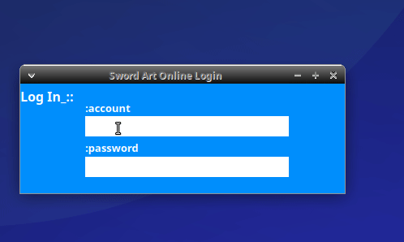

<h1 align="center">Login Sword Art Online </h1>

Este programa foi desenvolvido por um fã de sword art online, e iniciante em python como um meio a se desafiar.

##Sobre 📘

Desenvolvido como um desafio, ele é sem utilidade para mim,por isso deixo a .ui dentro da pasta **assets** para qualquer um que deseje torna-lo funcional além de que estará disponivel sobre a licença gpl v3 

###Tecnologias utilizadas 🚀

- [Python3](https://www.python.org)
- [PyQt5](https://pypi.org/project/PyQt5/)
- [Qt-designer](https://doc.qt.io/qt-5/qtdesigner-manual.html)
